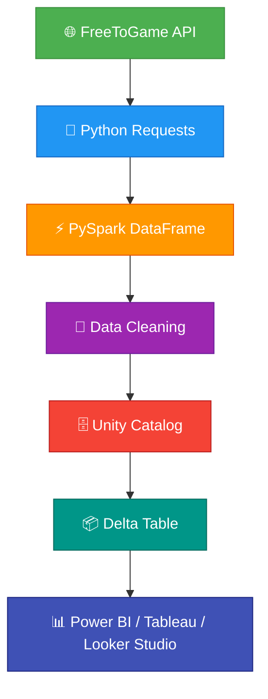

<div align="center">


# 🎮 FreeToGame Analytics Pipeline & Dashboard

### End-to-End BI Project — Data Extraction → Cleaning → Power BI · Tableau · Looker Studio


> A complete end-to-end analyst portfolio project built across three industry-standard BI platforms.
> FreeToGame public API →Raw data → Cleaning → Modeling → Power BI · Tableau · Looker Studio

</div>

---


## 📑 Table of Contents

- [Project Overview](#project-overview)
- [Business Problem](#business-problem)
- [Data Source](#data-source)
- [ETL Workflow](#etl-workflow)
- [Data Architecture](#data-architecture)
- [Data Storage](#data-storage)
- [Dashboard Features](#dashboard-features)
- [Tech Stack](#tech-stack)
- [Skills Demonstrated](#skills-demonstrated)
- [Repository Structure](#-repository-structure)
- [How to Run](#how-to-run)
- [Author](#author)
- [License](#License)

---

##  Project Overview

This project demonstrates an end-to-end data engineering and business intelligence workflow using Databricks, PySpark, Delta Lake, and modern visualization tools.
The pipeline extracts game data from the FreeToGame public API, performs data cleansing and transformation in Databricks, stores the processed data in Unity Catalog Delta Tables, and delivers interactive dashboards using Google Looker Studio, Tableau, and Power BI.
The project showcases practical data engineering concepts including API ingestion, data transformation, data storage, and business intelligence reporting.

## Business Problem

Gaming platforms generate large volumes of game metadata across multiple genres, publishers, developers, and platforms. Stakeholders require a centralized analytical view to understand:  
•	Distribution of games by genre  
•	Platform popularity  
•	Publisher and developer performance  
•	Release trends over time  
•	Overall game catalog insights  
This project builds a scalable analytics pipeline to transform raw API data into meaningful business insights.

## DATA

Overview of the dataset used in this project.

### Data Source

This project uses the FreeToGame public API, which provides comprehensive information about free-to-play games across multiple platforms and genres.

API Endpoint

https://www.freetogame.com/api/games

### Dataset Overview

The dataset contains metadata related to free-to-play games, including:

### Dataset Overview

The dataset contains metadata related to free-to-play games, including:

| Column Name        | Data Type | Description                     |
|--------------------|-----------|---------------------------------|
| `id`               | Integer   | Unique identifier for each game |
| `title`            | String    | Name of the game                |
| `genre`            | String    | Game category (e.g., Action, RPG) |
| `platform`         | String    | Supported gaming platform       |
| `publisher`        | String    | Company that published the game |
| `developer`        | String    | Company that developed the game |
| `release_date`     | Date      | Official game release date      |
| `short_description`| Text      | Short summary of the game       |
| `thumbnail`        | URL       | Link to game thumbnail image    |
| `game_url`         | URL       | Link to game detail page        |  


### Data Quality & Cleaning

The following data preparation steps were performed using PySpark:

Removed duplicate records based on game ID  
Standardized data types  
Validated schema consistency  
Inspected null and missing values  
Cleaned and trimmed text fields  
Converted date fields for analytics reporting  

## ETL Workflow

### Extract
Data was extracted from the FreeToGame REST API using Python and loaded into a Spark DataFrame within Databricks

### Transform
Data transformation activities included:

Duplicate removal  
Data validation  
Date formatting  
Text standardization  
Data quality checks  

### Load

The cleaned dataset was stored as a Delta Table in Databricks Unity Catalog.

## Data Architecture



## Data Storage

Platform: Databricks Free Edition

Catalog: dataset

Schema: freetogame

Table: games

Storage Format: Delta Lake

The final cleaned dataset is stored as a managed Delta Table within Unity Catalog, enabling efficient querying and reporting.

## Dashboard Features

### Google Looker Studio

Interactive dashboard providing:  
•	Games by Genre  
•	Platform Distribution  
•	Publisher Analysis  
•	Release Trends  
•	Interactive Filtering  

Dashboard:  https://datastudio.google.com/reporting/93de7600-f43a-48ba-bc5e-26d862d40de3/page/T1C2F


###Tableau Dashboard

Interactive visual analytics including:
•	Genre Breakdown
•	Platform Performance
•	Release Timeline
•	Publisher Insights
•	Dynamic Filtering

Dashboard: https://public.tableau.com/app/profile/ajit.jha/viz/FreeToGameAnalyticsDashboard/Dashboard1?publish=yes


###Power BI Dashboard

Developed using Microsoft Power BI Desktop.
•	KPIs
•	Platform Performance
•	Publisher and developer contribution analysis
•	Release Timelin

## Tech Stack

### Data Engineering

•	Databricks Free Edition
•	PySpark
•	Python
•	Unity Catalog
•	Delta Lake

### Data Visualization
•	Google Looker Studio
•	Tableau Public
•	Microsoft Power BI Desktop

### Version Control
•	GitHub

## Skills Demonstrated

### Data Engineering  
•	REST API Integration  
•	Data Ingestion  
•	PySpark Transformations  
•	Delta Lake Storage  
•	Unity Catalog Management  
•	Data Quality Validation  

### Analytics Engineering  
•	Data Modeling  
•	KPI Development  
•	Business Metrics Design  

### Business Intelligence  
•	Power BI  
•	Tableau  
•	Looker Studio  
•	Interactive Dashboard Development  
•	Data Storytelling  

## Repository Structure

## 📂 Repository Structure

```text
FreeToGame-Analytics/
│
├── Dataset/                  # Dataset
│   └── Games_Dataset.csv      # Games dataset
│
├── notebooks/                  # ETL Pipeline
│   └── data_pipeline.py        # API extraction, data cleaning, and loading
│
├── dashboards/                 # Business Intelligence Dashboards
│   ├── powerbi/                # Power BI project files
│   └── tableau/                # Tableau workbook files
│
├── assets/                     # Dashboard previews and documentation assets
│   ├── powerbi.png             # Power BI dashboard screenshot
│   ├── tableau.png             # Tableau dashboard screenshot
│   └── looker.png              # Looker Studio dashboard screenshot
│
├── LICENSE                     # Project license
└── README.md                   # Project documentation
```

### Folder Description

| Folder/File     | Purpose                                                                         |
| --------------- | ------------------------------------------------------------------------------- |
| **notebooks/**  | Contains the Databricks ETL pipeline used to extract, clean, and store data.    |
| **dashboards/** | Stores BI dashboard files created in Power BI and Tableau.                      |
| **assets/**     | Contains dashboard screenshots and images used in documentation.                |
| **LICENSE**     | Defines the project's usage and distribution terms.                             |
| **README.md**   | Provides project overview, architecture, setup instructions, and documentation. |


## How to Run

### 1. Clone the Repository

```bash
git clone https://github.com/Ajitjha3095/FreeToGame-Analytics-Pipeline-Dashboard-June-2026.git
cd FreeToGame-Analytics-Pipeline-Dashboard-June-2026
```

### 2. Open Databricks

* Sign in to Databricks Free Edition.
* Create a new notebook.
* Upload or copy the ETL script from `notebooks/data_pipeline.py`.

### 3. Execute the ETL Pipeline

Run the notebook to:

* Extract data from the FreeToGame API
* Create a PySpark DataFrame
* Clean and transform the data
* Save the processed dataset to Unity Catalog

### 4. Verify Data Storage

Confirm that the table has been successfully created:

```text
Catalog: dataset
Schema : freetogame
Table  : games
```

### 5. Explore Dashboards

Open the dashboards to analyze gaming trends and insights:

* Power BI Desktop
* Tableau Public
* Looker Studio

### 6. Review Results

Use the dashboards to explore:

* Genre distribution
* Platform analysis
* Publisher insights
* Game release trends
* Interactive filtering and reporting


## Author

**Ajit Jha**  
*Data Analytics & Data Engineering Portfolio Project*

- **GitHub:** [Ajitjha3095](https://github.com/Ajitjha3095)
- **LinkedIn:** [your-linkedin-profile](https://linkedin.com/in/your-linkedin-profile)

---

## License

This project is licensed under the **MIT License**.  
See the [LICENSE](LICENSE) file for details.


